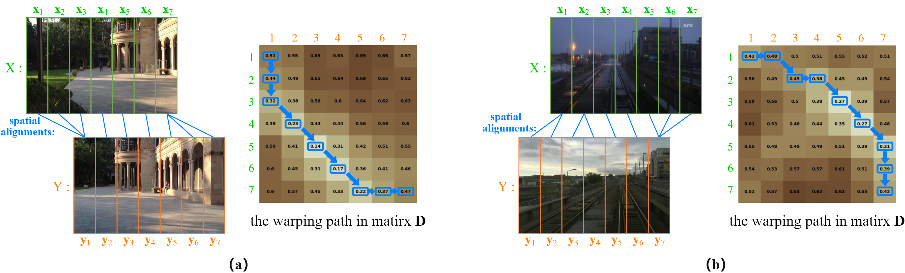

# STA-VPR
This repository provides the code for our paper "[STA-VPR: Spatio-temporal Alignment for Visual Place Recognition](https://ieeexplore.ieee.org/document/9382071)" by Feng Lu, Baifan Chen, Xiang-Dong Zhou, and Dezhen Song. The arXiv pre-print can found [here](https://arxiv.org/abs/2103.13580).



## Installation
- Python ≥3.5
- cuda ≥9.0
- Numba ≥0.44.1
- PyTorch ≥1.1
- Keras ≥2.2.4
- TensorFlow ≥1.10
- scikit-learn ≥0.19

The Keras and TensorFlow are only required by the VGG16 model (will be downloaded when you run the code). You can just install PyTorch if you only need to use the DenseNet161 model.

## Steps
- Download the [DenseNet161](http://places2.csail.mit.edu/models_places365/densenet161_places365.pth.tar) model pretrained on [Places365](https://github.com/CSAILVision/places365) and copy them to the STA-VPR folder. Note that if you use this pretrained model, please see the License required by [Places365](https://github.com/CSAILVision/places365).
- You will need to update the configuration file "STAVPRconfig.yaml" changing some information, such as the file pathes of your images, model name, and so on. File names of images are expected in the format ImageXXX.jpg (e.g. Image000.jpg). You can modify the expected format in vgg.py (Line 25 and 42) and densenet.py (Line 81 and 100).
- Run the 'STAVPRdemo.py' to get the matched result of all query sequences, F-score and PR curve. If you don't want to install Numba. You can change "STAVPR" in Line 19 in STAVPRdemo.py to "STAVPR_nonumba", to run the version without Numba (this version is not optimized and very time-consuming).
```
python3 STAVPRdemo.py
```
- STAVPRdemo.py will output a file "test.txt" that records the distance matrix between reference data and query data (you can comment out Line 176 if don't need it), but not output temporal alignment between query seq and matched result seq. If you want know the alignment between a query seq and its matched seq, you can run the "temporal_align.py". (input parameter: -s: the start ID of query seq; -l: the length of query seq; -n: the file path+name of the distance matrix.)
```
python3 temporal_align.py -s 180 -l 20 -n test.txt
```
- In addition. If you want know the spatial alignment between two images, you can run the "spatial_align.py". (input parameter: -x: the path+name of the image X; -y: the path+name of the image Y.)
```
python3 spatial_align.py -x ./images/left.jpg -y ./images/right.jpg
```

## Datasets 

The datasets used in this work:
- [Nordland (synth-Nord)](https://www.dropbox.com/s/o7lm0c9bv18q4zx/Nordland3584.zip?dl=0)*
- [Gardens Point](https://www.dropbox.com/s/171k7xq2fgt5n6j/Gardens%20Point.zip?dl=0)
- [UA](https://www.dropbox.com/s/q79bud2ruc41any/UA.zip?dl=0)
- [Berlin_A100](https://www.dropbox.com/s/3bdgpv0top3pj0a/BerlinA100.zip?dl=0)

*The images of this Nordland dataset has been resized, and the experimental result may be slightly different from that reported in our paper.

## Citation

If you find this code or our work helpful for your research, please cite the following papers:
```
@ARTICLE{stavpr,
author={F. {Lu} and B. {Chen} and X. -D. {Zhou} and D. {Song}},
journal={IEEE Robotics and Automation Letters},
title={STA-VPR: Spatio-Temporal Alignment for Visual Place Recognition},
year={2021},
volume={6},
number={3},
pages={4297-4304},
doi={10.1109/LRA.2021.3067623}
}
```
